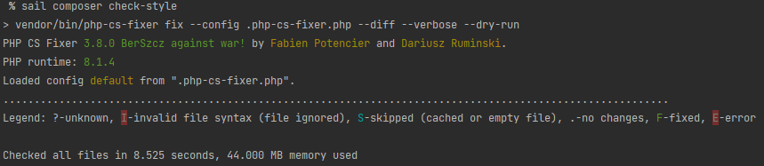

# Sumário
- [Introdução](#Introdução)
- [Arquitetura](#Arquitetura)
- [Instalação](#Instalação)
- [Qualidade](#Qualidade)
- [Documentação](#Documentação)

# Introdução

A DigitalMaps é uma empresa especializada na produção de receptores GPS.

Esse aplicativo é um dos microserviços da DigitalMaps, sua responsabilidades são: 
- **Armazenar** pontos de referência segundo sua **latitude**, **longitude** e **horário** de funcionamento.
- **Disponibilizar** os **pontos de referência**(previamente cadastrados) em funcionamento próximos ao usuário.

# Arquitetura

O microserviço foi desenvolvido na linguagem de programação PHP com framework Laravel 9.x.
Para armazenamento dos dados está sendo utilizado MySql com Eloquent(Laravel) implementado Repository Partner.

Hoje o microseviço funciona sobre três pilares, usuário, pontos de interesse e proximidades que reúne o local do usuário e interesse ao seu redor.

### Helpers

Por ser um projeto pequeno não houve a necessidade da criação de um ``helper.php`` file. Porém criei a _trait_ `\App\Helpers\AuthUser` utilizado apenas no _observer_ `\App\Observers\PointInterestObserver`

### Observers

Os _observers_ são utilizados para ouvirem eventos de um determinado modelo

``\App\Observers\PointInterestObserver``: Responsável por definir o usuário logado como criador do ponto de interesse recém registrado.

``\App\Observers\UserObserver``: Responsável por criptografar a senha do usuário recém-criado.

Todos os _observers_ são carregados automaticamente através do provider ``\App\Providers\ObserverServiceProvider``.

### Repositório

Repositório é um serviço que utilizo para armazenar lógica do meu modelo de dados. 

Para cada modelo eu tenho um Serviço de repositório que ficam armazenados na pasta ``app/Repositorios``.

Todos os repositórios são carregados automaticamente através do provider `\App\Providers\RepositoryServiceProvider` possibilitando a _dependency injection_.

# Instalação

### Pré-requisitos

- MacOS, Linux ou Windows (via [WSL2](https://docs.microsoft.com/en-us/windows/wsl/about))
- [Git](https://git-scm.com/about)

### Baixando microserviço

Nosso primeiro passo será clonar o projeto para sua maquina.

```shell
git clone https://github.com/SOSTheBlack/digital-maps

cd digital-maps
```

Faça uma cópia do arquivo .env.example e o nomei de .env com o comando abaixo:
````shell
cp .env.example .env
````

### Instalando dependências

Este comando usa um pequeno container Docker contendo PHP e Composer para instalar as dependências do aplicativo:
````shell
docker run --rm \
    -u "$(id -u):$(id -g)" \
    -v $(pwd):/var/www/html \
    -w /var/www/html \
    laravelsail/php81-composer:latest \
    composer install --ignore-platform-reqs
````

### Iniciando microserviço

No projeto é utilizado [Laravel Sail](https://laravel.com/docs/9.x/sail), uma interface de linha de comando leve para interagir com o ambiente de desenvolvimento [Docker](https://www.docker.com/why-docker/).

Antes de iniciar o microserviço, você deve garantir que nenhum outro servidor web ou banco de dados esteja rodando em seu computador local.

Para iniciar todos os containers Docker definidos, você deve executar o comando ``up``:

```shell
./vendor/bin/sail up
```


Uma vez iniciados os containers da aplicação, você pode acessar o projeto em seu navegador web em: ``http://localhost``

### Interagindo com o banco de dados

Para se conectar ao banco de dados MySQL a partir de sua máquina local, você pode usar um aplicativo gráfico de gerenciamento de banco de dados, como o TablePlus.

Por padrão, o banco de dados MySQL está acessível na localhostporta 3306.

````dotenv
HOST=localhost
USERNAME=root
PASSWORD=password
DATABASE=digital-maps
````

### Configurando alias

Por padrão, os comandos Sail são invocados usando o vendor/bin/sail.

No entanto, em vez de digitar repetidamente vendor/bin/sail para executar os comandos do Sail, você pode configurar um alias do Bash que permita executar os comandos do Sail com mais facilidade:
```shell
alias sail='[ -f sail ] && bash sail || bash vendor/bin/sail'
```

Uma vez que o alias Bash tenha sido configurado, você pode executar comandos Sail simplesmente digitando sail.

````shell
sail up -d
````

Todos os próximos exemplos de comando será levado em consideração esse alias.

### Parando o microserviço

Para parar todos os containers do microserviço, você pode simplesmente pressionar Control + C para parar a execução do container. Ou, se os containers estiverem rodando em segundo plano, você pode usar o ``stop`` comando:

````shell
sail stop
````

# Qualidade do Código

### Testes automatizados

O Aplicativo DigitalMaps foi construído com tests em mente.

Para executar os tests que ficam no diretório ``/tests`` basta executar o comando abaixo:

````shell
sail test
````


### PHP-CS-Fixer

O [PHP-CS-Fixer](https://github.com/FriendsOfPHP/PHP-CS-Fixer) é um fixador de padrões de codificação PHP, ele corrige todo o estilo do seu código, quebras, espaços, estilo de declarações, dentre outros.

A configuração do estilo do código seguido é [PSR-12](https://www.php-fig.org/psr/psr-12/), detalhes e configurações do estilo do código pode ser obtido através do arquivo ``.php-cs-fixer.php`` na raiz desse projeto.

Para verificar se estilo do código está seguindo os padrões de desenvolvimento definido execute o comando abaixo:

````shell
sail composer check-style
````



### PHPStan

O [PHPStan](https://github.com/phpstan/phpstan) se concentra em encontrar erros em seu código sem realmente executá-lo. Ele captura classes inteiras de bugs antes mesmo de você escrever testes para o código. Ele aproxima o PHP das linguagens compiladas no sentido de que a correção de cada linha do código pode ser verificada antes de você executar a linha atual.

Resumidamente ele é um analisador estático que varre o código da sua aplicação procurando por erros e incongruências sem que haja a necessidade de executá-lo, a análise é toda estática. É uma ferramenta essencial para te apontar bugs ou erros que certamente aparecerão em algum momento do uso da aplicação.

O PHPStan está analisando o código no nível mais estrito(**9**) possível. Para executar esse analisador de código, basta executar o comando abaixo:

````shell
sail composer phpstan
````


### PHPInsights

O [PHPInsights](https://phpinsights.com/) analisa a qualidade do código. Ele divide a análise em quatro categorias: código, complexidade (complexidade ciclomática etc), arquitetura (tamanho de métodos e classes, entre outras análises) e estilo de código (formatação, padronização).

Para executar esse analisador de código, basta executar o comando abaixo:

````shell
sail composer phpinsights
````


# Documentação

A documentação do aplicativo pode ser importado para o seu Postman através do botão abaixo:

[](https://app.getpostman.com/run-collection/180952-861dd8da-216c-43b6-980c-a8d5953605e3?action=collection%2Ffork&collection-url=entityId%3D180952-861dd8da-216c-43b6-980c-a8d5953605e3%26entityType%3Dcollection%26workspaceId%3D9ff1b393-f814-4463-bcc3-414ac91c28ab#?env%5Bdigital-mpas%5D=W3sia2V5IjoiYmFzZV91cmwiLCJ2YWx1ZSI6Imh0dHA6Ly9kaWdpdGFsLW1hcHMudGVzdC9hcGkiLCJlbmFibGVkIjp0cnVlLCJ0eXBlIjoiZGVmYXVsdCJ9LHsia2V5IjoiYWNjZXNzX3Rva2VuIiwidmFsdWUiOiJjYzc4MWQzYmJhNThlZWU1OGJiNWQ5MzUyMDRkNjEyYTRlNTMxNjcyZTA5MjcyNmQwZTE1NWIxZTI1OTc3MjM2IiwiZW5hYmxlZCI6dHJ1ZSwidHlwZSI6ImRlZmF1bHQifV0=)


